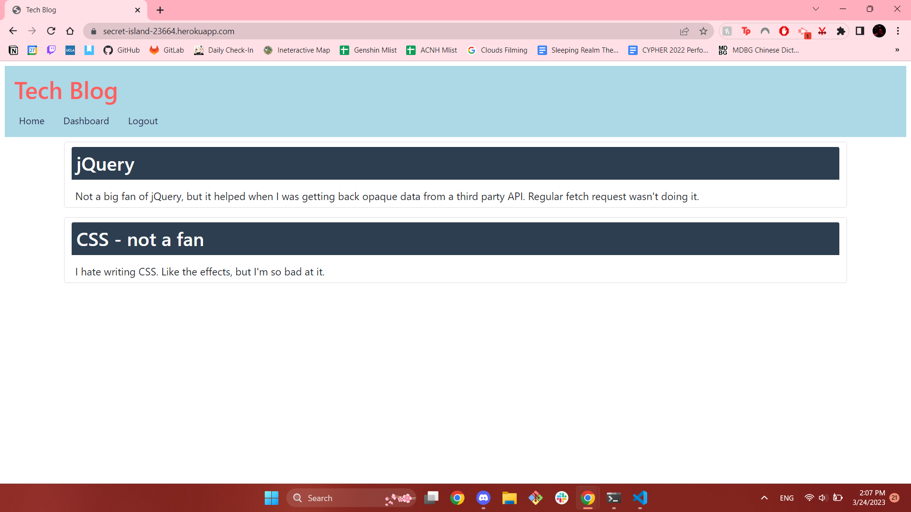

# Tech Blog []

  ## Description

  This project is a fullstack blog for users to post about new discoveries of commentary regarding technology. After signing up, a user is able to post, comment on others' posts, and update or delete their own posts. Upon navigating to the [application](https://secret-island-23664.herokuapp.com/), a user should be greeted with a homepage: 
  
  Through development of this application, I have gained more comfort using handlebars as a template engine, and making the routes to be able to pass data back and forth from the front and back ends.   

  ---
  ## Table of Contents 

  - [Installation](#instlalation)
  - [Usage](#usage)
  - [License](#license) 
  - [Contributing](#contributing)
  - [Tests](#tests)
  ---

  ## Installation

  To install this application, a developer must clone this repo, and on the commandline install all dependencies (command: npm i). 

  Before initalization, the user should be sure to change their database to the proper appropriate database in the MySQL command line (mysql -u {user} -p, replacing the user with the proper user, and enter the proper associated password when prompted). 
  
  Once succesfully in the MySQL command line, source the schema (source db/schema.sql).

  Additionally, a user should ensure that all their sensitive MySQL information is safely stored in a .env file. For more information on .env, please look at the [dotenv documentation](https://www.npmjs.com/package/dotenv)
  
  To initalize this application, use command npm start. After use, a user should be sure to kill the terminal to ensure the end of the server. 

  For commercial use, just going to the [link](https://secret-island-23664.herokuapp.com/) and signing up will work.

  ## Usage 

  To make full use of this application, one should remember their email and password. Click [here](https://secret-island-23664.herokuapp.com/) to go to the application. 

  ## License
  
  [License: MIT](https://opensource.org/licenses/MIT)
  
  Copyright 2023 Anna Langford
  
  Permission is hereby granted, free of charge, to any person obtaining a copy of this software and associated documentation files (the "Software"), to deal in the Software without restriction, including without limitation the rights to use, copy, modify, merge, publish, distribute, sublicense, and/or sell copies of the Software, and to permit persons to whom the Software is furnished to do so, subject to the following conditions:
  
  The above copyright notice and this permission notice shall be included in all copies or substantial portions of the Software.
  
  THE SOFTWARE IS PROVIDED "AS IS", WITHOUT WARRANTY OF ANY KIND, EXPRESS OR IMPLIED, INCLUDING BUT NOT LIMITED TO THE WARRANTIES OF MERCHANTABILITY, FITNESS FOR A PARTICULAR PURPOSE AND NONINFRINGEMENT. IN NO EVENT SHALL THE AUTHORS OR COPYRIGHT HOLDERS BE LIABLE FOR ANY CLAIM, DAMAGES OR OTHER LIABILITY, WHETHER IN AN ACTION OF CONTRACT, TORT OR OTHERWISE, ARISING FROM, OUT OF OR IN CONNECTION WITH THE SOFTWARE OR THE USE OR OTHER DEALINGS IN THE SOFTWARE.

  ## Contributing

  No other developers contributed to this application. 

  ChatGBT was consulted regarding some bugs in the code, particularly in regards to conflicting event listeners in the public/js folder. 

  ## Tests

  This application has no tests.
